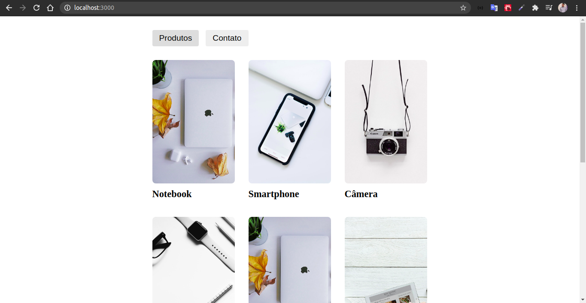
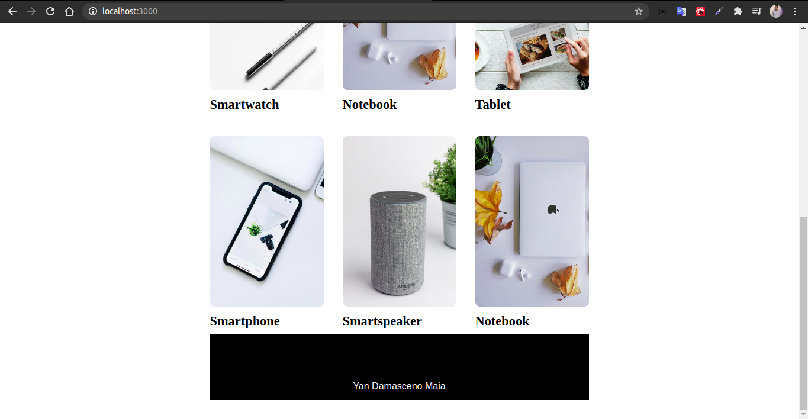

<h1><b>Loja Virtual</b></h1>

Projeto modelo de loja virtual que puxa lista de produtos de uma API externa onde o id de cada item é passado e retornado com os dados específicos de cada produto.

<h2>Projeto Final</h2>

<h2>Página do Produto</h2>

